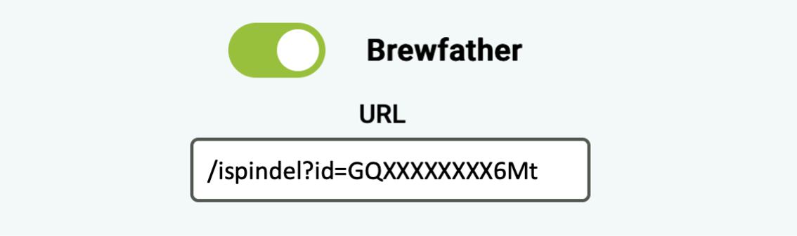

# Adjust Interval

!!! tip
    **Precondition:**\
    To make this setting you must have access to the user interface. If this is not the case, see here how to do it:

    [access-to-the-user-interface.md](../services/access-to-the-user-interface.md)

## Step 1: Open the Menue

To access the menu bar you have to click on the three lines in the upper left corner. (See arrow)\
Then the menu bar will open.

## Step 2: Select "Settings"

On this page, you can adjust various settings to personalize your experience with the device. Options you can customize include the interval at which the device collects and sends data, the units displayed on the main page, and the overhead detection feature. You can also enable temperature compensation to ensure accurate measurements. Take some time to explore the various settings available and make the necessary adjustments for your needs. or "Services"

## Step 3: Adjust Interval

Select the time the hydrom should sleep.

If you want to put the Hydrom to sleep immediately, you can select "DeepSleep" in the navigation bar.
Even if you switch the Hydrom off and on again via the switch, the Hydrom will be put into deep sleep after the first transmission of the measured values.

!!! info
    **Sleep time calculation**

    Currently the Hydrom needs 23sec. to start, set up the network, send out the readings.

    This means that for a constant transmission of data every 15min, you need to set a sleep time of 14min. 27sec.

### Save Settings

Saving the data is important because it is the only way to connect to the service after waking up from DeepSleep.

You can check whether the saving was successful by looking at the settings file at http://hydrom001/settings.json/. to check if the save was successful. This file is the permanent memory of the Hydrom.

A second way to check the saving is to reload the page (all browsers offer this). If the properties are then reloaded, the hydrom has accepted them, otherwise the old settings are reloaded.
