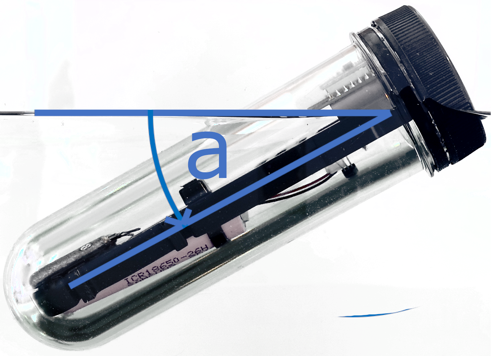

# Hydrom — Open-Source Smart Hydrometer

**Hydrom** is a free-floating smart hydrometer that measures the density of your beer, wine, or cider in real time — no more opening the fermenter to take manual readings.

---

<h3>📡 Wi-Fi</h3>

Connects to your home network and transmits measurements every few minutes — fully automatic.

<h3>🔵 Bluetooth LE</h3>

Broadcasts as an iBeacon — pick up readings on your smartphone without an internet connection.

<h3>☁️ Cloud Services</h3>

Direct integration with Brewfather, Brewer's Friend, Brewblox, Grainfather, MQTT, Google Sheets, and more.

<h3>🔋 Deep Sleep</h3>

Ultra-low power consumption. One charge lasts through an entire fermentation.

<h3>🔧 OTA Updates</h3>

Update firmware directly from the built-in web interface — no USB cable needed.

<h3>📖 Open Source</h3>

Firmware, hardware, and documentation are fully open. Build your own or contribute.

---

## Quick Start

New to Hydrom? These are the steps to get from unboxing to active monitoring:

| Step | Action |
|------|--------|
| 1 | [Read Safety Warnings](getting-started/warnings-read-before-use.md) |
| 2 | [Disinfect the Hydrom](getting-started/disinfect-before-use.md) |
| 3 | [Charge via USB-C](services/charging-the-hydrom.md) |
| 4 | [Switch on](services/turn-on-the-hydrom.md) and [enter Configuration Mode](services/wakeup-the-hydrom.md) |
| 5 | [Connect to your Wi-Fi](services/wifi-setup.md) |
| 6 | [Open the Web UI](services/access-to-the-user-interface.md) |
| 7 | [Calibrate](calibration/check-calibration.md) for accurate readings |
| 8 | [Connect a service](services/connect_to_brewfather.md) — e.g. Brewfather |

→ [Full Getting Started guide](getting-started/README.md)

---

## How It Works

The Hydrom floats in your liquid at an angle determined by the liquid's density. An onboard IMU (MPU-6050) measures this angle continuously, a DS18B20 temperature sensor compensates for temperature effects, and the firmware converts the result to specific gravity or °Plato. Data is transmitted via Wi-Fi every few minutes — or broadcast continuously as a Bluetooth Low Energy beacon.

---

## Licenses

| Component | License |
|-----------|---------|
| Firmware / Software | [GPL v3](https://github.com/TjGer22/Hydrom/blob/main/LICENSE) |
| PCB / Hardware | [CERN-OHL-S v2](https://github.com/TjGer22/Hydrom/blob/main/hardware/LICENSE-HARDWARE) |
| Documentation | [CC BY 4.0](https://github.com/TjGer22/Hydrom/blob/main/docs/LICENSE-DOCS) |

Contributions are welcome — see the [Contributing Guide](contributing.md).
