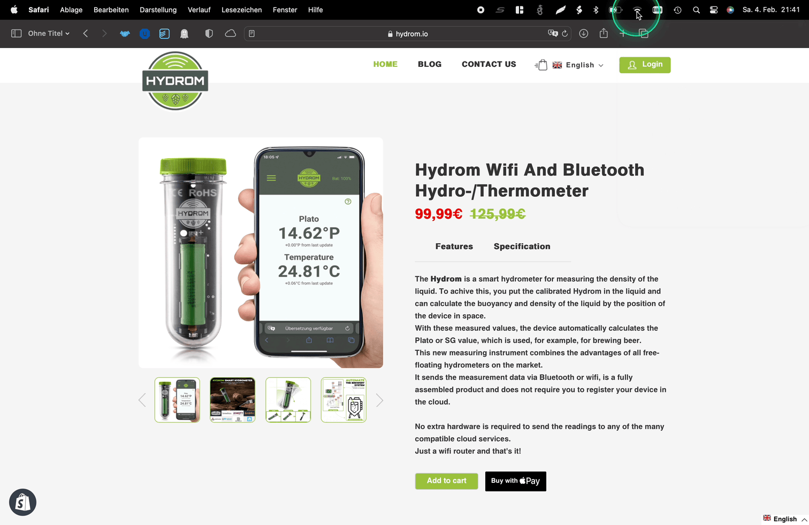

# Access to the user interface

!!! tip
    **Precondition:**

    1. The Hydrom must be powered on\
       How to switch on the Hydrom can be found here:\
       [turn-on-the-hydrom.md](turn-on-the-hydrom.md)
    2.  The Hydrom must be in configuration mode\
        In normal operation, no user interface is loaded in order not to waste the battery charge. Therefore, the Hydrom must be put into configuration mode.

        You can detect if the Hydrom is in Deepsleep when the green LED is on as described here: [Status LED](../getting-started/indicator-leds.md#status-led-of-the-hydrom-logic)

        If the Hydrom is in Deepsleep, it can be woken up according to the instructions on this page:\
        [wakeup-the-hydrom.md](wakeup-the-hydrom.md)

<figure><figcaption></figcaption></figure>

## Connect to the Hydrom via the Hydrom's configuration wifi.

### Step 1: Connect to the Hydrom's WLAN

1. turn on your smartphone, tablet or computer.
2. in your device's wifi settings, search for a wifi named "hydrom\_XXXXX". Select this Wi-Fi and connect to it.

### Step 2: Open the Hydrom user interface in the browser

1. open the internet browser on your device (e.g. Google Chrome, Mozilla Firefox or Safari). Enter the following address in the address bar of the browser: [http://192.168.2.1](http://192.168.2.1) and press Enter.

## Connect to the Hydrom via the existing WLAN (only if the Hydrom is already connected to the WLAN).

!!! info
    If the hydrom is already connected to your WLAN, it now has a different address. The old address "[http://192.168.2.1](http://192.168.2.1)" does not work anymore.

    If you don't know the new address, connect to the Hydrom WLAN as described in **step 1**.\
    Then go to the network settings in the Hydrom user interface. If the connection is successful, you will see the new address in a green box at the top of the page.

1. open your internet browser again. 2.
2. type the new address (e.g. "http://\<new IP>") in the address bar and press enter.

Now you should be able to see and use the Hydrom user interface.
