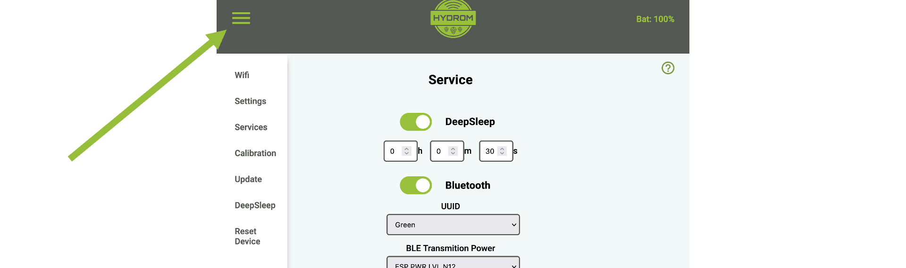

# Change Bluetooth Settings

!!! danger
    It is not possible to connect to the Hydrom via Bluetooth. \
    To receive the Bluetooth signals (iBeacon), please use the competitor's Tilt2app:\
    [https://tilthydrometer.com/pages/app](https://tilthydrometer.com/pages/app)

    If you have an iPhone, there is a BETA test currently running:

    [https://testflight.apple.com/join/UNli2kml](https://testflight.apple.com/join/UNli2kml)

!!! tip
    **Precondition:**

    To make this setting you must have access to the user interface. If this is not the case, see here how to do it:[access-to-the-user-interface.md](../access-to-the-user-interface.md)

## Step 1: Open the Menue

To access the menu bar you have to click on the three lines in the upper left corner. (See arrow)\
Then the menu bar will open.

<figure><figcaption></figcaption></figure>

## Select "Service"

The "Services" page is a resource that allows users to select and configure various interfaces and cloud services for use with their system. On this page, users can choose from three different interfaces - HTTP, MQTT, and TCP - and several cloud services, and then activate and parameterize these options to suit their needs. This page is a useful tool for those who want to connect their system to the cloud or other external services and customize the way in which data is transmitted and received. With the options available on the "Services" page, users can tailor their system to meet their specific requirements and ensure that it is able to communicate effectively with other devices and systems.

## Step 3: Enable Bluetooth

The Hydrom will now send the following measured values via bluetooth after a restart by DeepSleep. For this, DeepSleep must also be activated as shown in the picture below.

!!! warning
    The "test message" option is not available for Bluetooth. So you have to wait until the Hydrom wakes up from a deep sleep. Hier findest du die Anleitu

!!! warning
    The "test message" option is not available for Bluetooth. So you have to wait until the Hydrom wakes up from a deep sleep.

## Choose UUID

Up to 8 Hydrom can be connected in parallel via Bluetooth. The different devices are then assigned different colors.

## Choose the transmission power

In the Hydrom, the power with which Bluetooth is transmitted can be set here. The range increases with higher transmission power. But beware, the battery life will also decrease with higher transmission power.

The powers with ascending transmission power:

*   ESP\_PWR\_LVL\_N14

    Corresponding to -14dbm
*   ESP\_PWR\_LVL\_N11

    Corresponding to -11dbm
*   ESP\_PWR\_LVL\_N8

    Corresponding to -8dbm
*   ESP\_PWR\_LVL\_N5

    Corresponding to -5dbm
*   ESP\_PWR\_LVL\_N2

    Corresponding to -2dbm
*   ESP\_PWR\_LVL\_P1

    Corresponding to 1dbm
*   ESP\_PWR\_LVL\_P4

    Corresponding to 4dbm
*   ESP\_PWR\_LVL\_P7

    Corresponding to 7dbm

### Save Settings

Saving the data is important because it is the only way to connect to the service after waking up from DeepSleep.

You can check whether the saving was successful by looking at the settings file at http://hydrom001/settings.json/. to check if the save was successful. This file is the permanent memory of the Hydrom.

A second way to check the saving is to reload the page (all browsers offer this). If the properties are then reloaded, the hydrom has accepted them, otherwise the old settings are reloaded.

### activate DeepSleep

Activating DeepSleep is mandatory for the hydrom to be able to send data. If DeepSleep is activated, the hydrom wakes up after the set time and sends the data to the set service. Afterwards, the hydrom goes back to sleep and waits for the new service.

[enable-deepsleep.md](../../configuration/enable-deepsleep.md)
