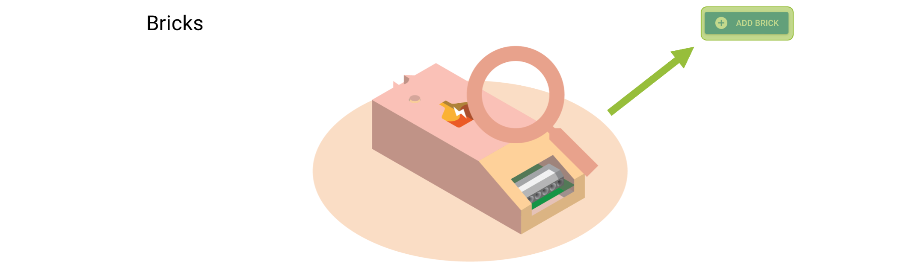
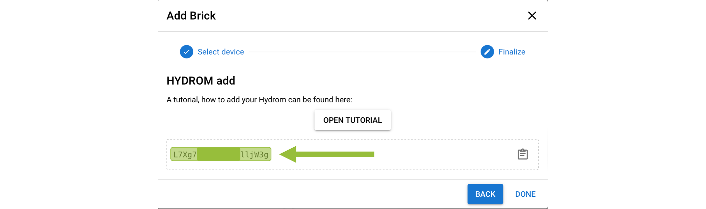

# Connect the Hydrom to BierBot Bricks

!!! tip
    **Prerequisite:**

    1. **Access to user interface**\
       To make this setting, you must have access to the user interface. If this is not the case, see here how to do it:[access-to-the-user-interface.md](access-to-the-user-interface.md)
    2. **BierBot Bricks account available**.\
       To use BierBot Bricks, you need an account. You can register here: [https://bierbot.com](https://bierbot.com)

## Prepare the service

### Create brick in the BierBot brewery

To do this navigate to the BierBot Bricks website and log in. Then click on the "Brewery" tab. Then click on the "Add Brick" button.

Choose HYDROM as type of brick you want to add. Then click on the "Add Brick" button.

### Copy the API token

After the brick has been added, you will be redirected to the brick settings. Here you can find the API token. Copy the API token and save it for later use.

<figure><figcaption></figcaption></figure>

When the Hydrom sends measured values to the BierBot Bricks service for the first time, the new device is displayed in the brewery under "Bricks" with all measured values.\
The fastest way to get the device displayed is to set the interval in the Hydrom to 1 second.\
Then BierBot Bricks will automatically set the time to 15min.

### Activate the Device

If the device is displayed under the Bricks, it still needs to be activated.

### Set custom logging interval

The default logging interval is 15 minutes. If you want to change this interval, you can do so here. To do this, click on the "Settings" tab and then on the "Logging" tab.

<figure><figcaption></figcaption></figure>

Activate "Set Custom Interval" (1). Then change the logging interval to the desired value (2) and click on the "Save" button (3).

<figure><figcaption>
Set custom logging interval
</figcaption></figure>

## Insert BierBot Bricks settings in Hydrom

Now open the user interface of the Hydrom, in the best case the Hydrom is already in the network and can be easily accessed via Webpage.\
If there are questions about how to get to the user interface, the following page is recommended: [access-to-the-user-interface.md](access-to-the-user-interface.md)

Otherwise the Hydrom must still be started.

### Step 1: Open the Menue

To access the menu bar you have to click on the three lines in the upper left corner. (See arrow)\
Then the menu bar will open.

### Step 2: Select "Service"

The "Services" page is a resource that allows users to select and configure various interfaces and cloud services for use with their system. On this page, users can choose from three different interfaces - HTTP, MQTT, and TCP - and several cloud services, and then activate and parameterize these options to suit their needs. This page is a useful tool for those who want to connect their system to the cloud or other external services and customize the way in which data is transmitted and received. With the options available on the "Services" page, users can tailor their system to meet their specific requirements and ensure that it is able to communicate effectively with other devices and systems.

### Step 3: Activate BierBot Bricks and change the settings.

On the "Service" page, you need to activate the BierBot Bricks service. Copy the API token from the BierBot Bricks website and paste it into the "Token" field.

!!! info
    The token must be entered without any spaces. If there are spaces, the token will not be accepted.

.png>)

The Deepsleep interval set here will be ignored, cause the Bierbot Bricks API will set the setted interval in the Bierbot Bricks brewery.\
The default value is 15 minutes.\
If you want this Interval to be different, you have to change it in the BierBot Bricks brewery (see above).

### additional settings

In order not to consume too much power, we would turn Bluetooth off when it is not needed. It was documented here:

[Enable Bluetooth on the Hydrom](bluetooth/README.md)

In order for the Hydrom to transmit the data reliably, a DeepSleep time must be set. This is documented on this page:

[enable-deepsleep.md](../configuration/enable-deepsleep.md)

### Save Settings

Saving the data is important because it is the only way to connect to the service after waking up from DeepSleep.

You can check whether the saving was successful by looking at the settings file at http://hydrom001/settings.json/. to check if the save was successful. This file is the permanent memory of the Hydrom.

A second way to check the saving is to reload the page (all modern browsers offer this Feature). If the properties are then reloaded, the hydrom has accepted them, otherwise the old settings are reloaded.

### activate DeepSleep

Activating DeepSleep is mandatory for the hydrom to be able to send data. If DeepSleep is activated, the hydrom wakes up after the set time and sends the data to the set service. Afterwards, the hydrom goes back to sleep and waits for the new service.

[enable-deepsleep.md](../configuration/enable-deepsleep.md)

!!! tip
    To ensure that the device sends measured values to the Service in the set interval as intended, the Hydrom must be put into deep sleep.

    There are two ways to put the Hydrom into deep sleep.

    Turning the _**power switch off and on**_ is the easiest way to put the Hydrom into deep sleep.

    The alternative way is to put it to sleep _**via the UI**_. To do this, open the navigation bar and go to the "DeepSleep" tab.
