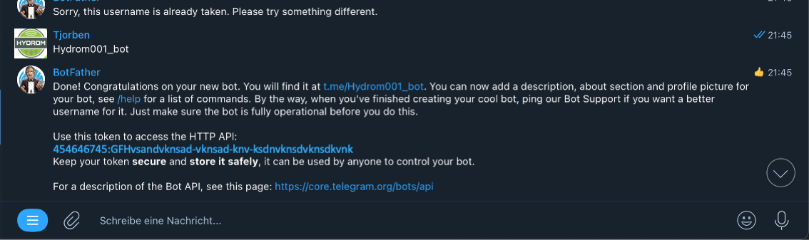
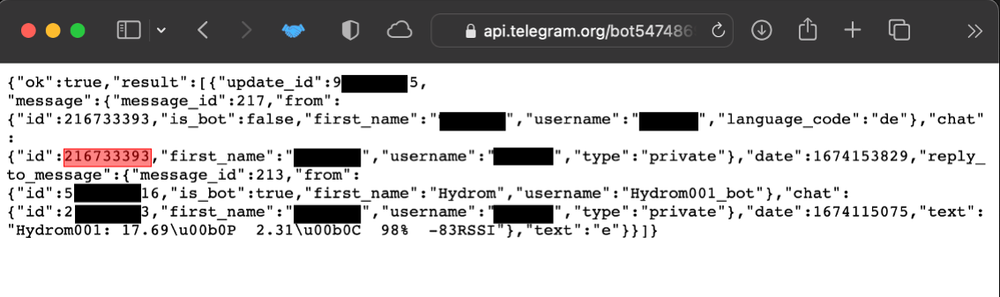
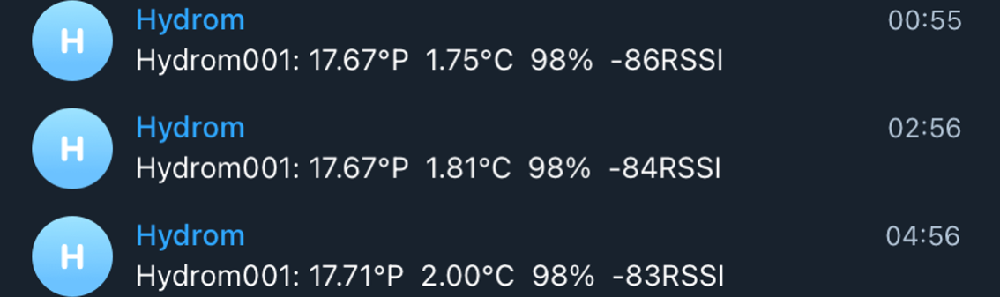

# Connect the Hydrom to Telegram

!!! tip
    **Prerequisite:**

    1. **Access to user interface**\
       To make this setting, you must have access to the user interface. If this is not the case, see here how to do it:[access-to-the-user-interface.md](access-to-the-user-interface.md)
    2. **Telegram account available**.\
       An account has been created with the Telegram messaging service.
    3. **Telegram App was downloaded**.\
       https://telegram.org

## Prepare the service

### Create a bot

Log in to Telegram and search for the bot "BotFather". Send a message to Bot Father with the text "/newbot" (without quotes). Choose a name and a username for your bot. The username must end with "bot". The usernames are only used to identify the chat in Telegram. 

### Identify the Telegram ChatID

Start a conversation with the bot for which you want to determine the chat ID. Call the URL "https://api.telegram.org/bot\[API\_TOKEN]/getUpdates", inserting the bot's API token in place of \[API\_TOKEN]. This will give you a JSON response with information about all of the bot's recent conversations. In the response, look for the "message" section, and note the chat ID, which is given as "chat" -> "id". 

## Insert Telegram settings in Hydrom

Now open the user interface of the Hydrom, in the best case the Hydrom is already in the network and can be easily accessed via Webpage.\
If there are questions about how to get to the user interface, the following page is recommended: [access-to-the-user-interface.md](access-to-the-user-interface.md)

Otherwise the Hydrom must still be started.

## Step 1: Open the Menue

To access the menu bar you have to click on the three lines in the upper left corner. (See arrow)\
Then the menu bar will open.

## Step 2: Select "Service"

The "Services" page is a resource that allows users to select and configure various interfaces and cloud services for use with their system. On this page, users can choose from three different interfaces - HTTP, MQTT, and TCP - and several cloud services, and then activate and parameterize these options to suit their needs. This page is a useful tool for those who want to connect their system to the cloud or other external services and customize the way in which data is transmitted and received. With the options available on the "Services" page, users can tailor their system to meet their specific requirements and ensure that it is able to communicate effectively with other devices and systems.

### Step 3: Activate Telegram and change the settings.

On the "Service" page, you need to activate the Telegram service. Copy the \[API\_TOKEN] and the ChatID into the fields provided.

After the service is set up in the hydrom and the hydrom is put into deep sleep, the data is sent to the Telegram chat at the set interval as shown here.

### additional settings

In order not to consume too much power, we would turn Bluetooth off when it is not needed. It was documented here:

[Enable Bluetooth on the Hydrom](bluetooth/README.md)

In order for the Hydrom to transmit the data reliably, a DeepSleep time must be set. This is documented on this page:

[enable-deepsleep.md](../configuration/enable-deepsleep.md)

### Save Settings

Saving the data is important because it is the only way to connect to the service after waking up from DeepSleep.

You can check whether the saving was successful by looking at the settings file at http://hydrom001/settings.json/. to check if the save was successful. This file is the permanent memory of the Hydrom.

A second way to check the saving is to reload the page (all modern browsers offer this Feature). If the properties are then reloaded, the hydrom has accepted them, otherwise the old settings are reloaded.

### activate DeepSleep

Activating DeepSleep is mandatory for the hydrom to be able to send data. If DeepSleep is activated, the hydrom wakes up after the set time and sends the data to the set service. Afterwards, the hydrom goes back to sleep and waits for the new service.

[enable-deepsleep.md](../configuration/enable-deepsleep.md)

!!! tip
    To ensure that the device sends measured values to the Service in the set interval as intended, the Hydrom must be put into deep sleep.

    There are two ways to put the Hydrom into deep sleep.

    Turning the _**power switch off and on**_ is the easiest way to put the Hydrom into deep sleep.

    The alternative way is to put it to sleep _**via the UI**_. To do this, open the navigation bar and go to the "DeepSleep" tab.
