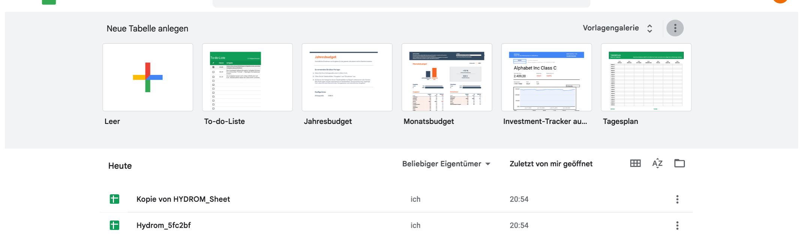
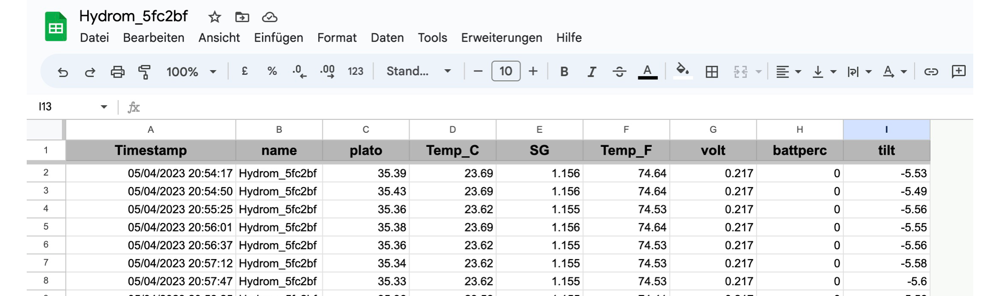
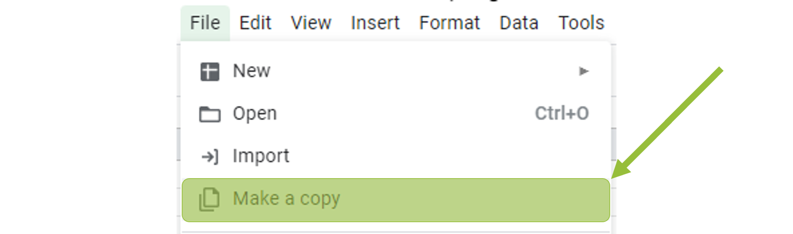
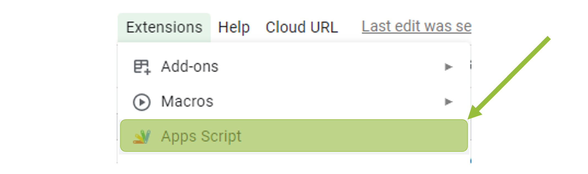
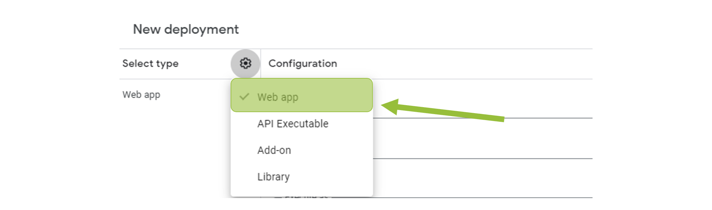
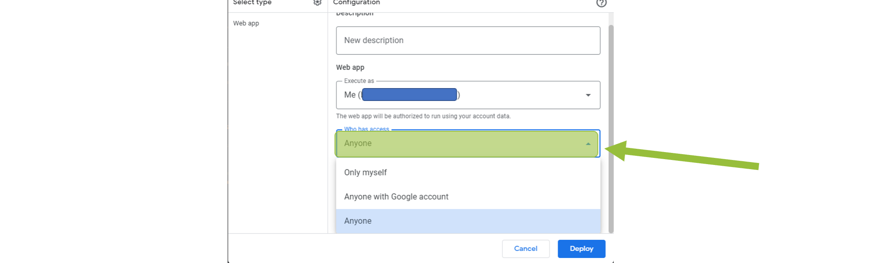
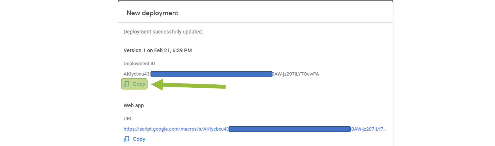

# Connect the Hydrom to Google Sheets

!!! tip
    **Prerequisite**

    1. To make this setting, you must have access to the user interface. If you don't, see here how to do it:\
       [Access to the user Interface](access-to-the-user-interface.md)
    2. **Google account available** To use Google Sheets, you need a Google account. You can register here: [https://accounts.google.com](https://google.com)

## Principle behind the Google Sheet integration

After the Hydrom has been successfully put into deep sleep, it will automatically begin submitting its collected and calculated readings to the user's Google account. Following this, Google Sheets automatically creates a new worksheet whose title corresponds to the name of the hydrom in question.

In this newly created Sheet, the received data variables are clearly organized and stored in different columns so that the user can easily access and analyze them.

## Prepare the sheet

### Copy the sheet from the Bonorum account

Call the following link:

[https://docs.google.com/spreadsheets/d/1v6VI\_eaHwb0OGDMxZvnlsiRH7fhhiMUscAlDiQi-g14](https://docs.google.com/spreadsheets/d/1v6VI\_eaHwb0OGDMxZvnlsiRH7fhhiMUscAlDiQi-g14)

### Deploy the script

click on the gear in the type selector, then select "Web App" 

Click "Authorize Access" when the window appears and select your Google account.

### Copy the token

## Setting up the Hydrom

Now open the Hydrom's user interface.

### Step 1: Open menu bar

To access the menu bar, you need to click on the three lines in the upper left corner. (See arrow)\
Then the menu bar will open.

### Step 2: Select "Service

On the "Services" page, you have the option to select and configure various interfaces and cloud services for use with its system. On this page, users can choose from three different interfaces - HTTP, MQTT, and TCP - and several cloud services, and then enable and parameterize these options to fit their needs. This page is a useful tool for those who want to connect their system to the cloud or other external services and customize the way data is transmitted and received. With the options available on the Services page, users can customize their system to meet their specific needs and ensure that it can communicate effectively with other devices and systems.

### Step 3: Enable Google Sheets and change the settings.

On the "Service" page, you need to enable the Google Sheets service. Copy the API token from the Google page and paste it into the "Token" field.

!!! info
    The token must be entered without spaces. If there are spaces, the token will not be accepted.

### additional settings

To avoid using too much power, we would turn off Bluetooth when it is not needed. This was documented here:

[Enable Bluetooth on the Hydrom](bluetooth/README.md)

In order for the hydrom to transmit data reliably, a DeepSleep time must be set. This is documented on this page:

[enable-deepsleep.md](../configuration/enable-deepsleep.md)

### Save settings

Saving the data is important because it is the only way to connect to the service after waking up from DeepSleep.

You can check if the save was successful by looking at the settings file at http://hydrom001/settings.json/. This file is the persistent storage of the hydrom.

A second way to check the saving is to reload the page (all browsers offer this). If then the properties are reloaded, the hydrom has accepted them, otherwise the old settings are reloaded.

### Activate DeepSleep

Enabling DeepSleep is mandatory for the hydrom to send data. If DeepSleep is activated, the hydrom wakes up after the specified time and sends the data to the set service. After that, the hydrom goes back to sleep and waits for the new service.

[enable-deepsleep.md](../configuration/enable-deepsleep.md)

!!! tip
    In order for the device to send readings to the service at the set interval as intended, the Hydrom must be put into deep sleep.

    There are two ways to put the Hydrom into deep sleep.

    The easiest way to put the Hydrom into deep sleep is to _**turn the power switch**_ off and on.

    The other way is to put the device into deep sleep _**using the user interface**_. To do this, open the navigation bar and go to the "DeepSleep" tab.
