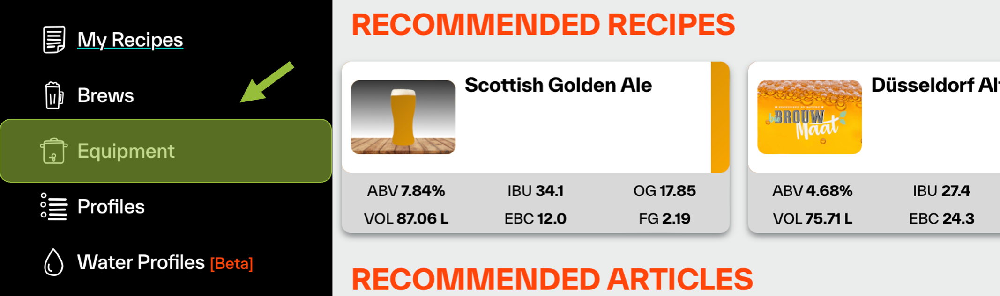
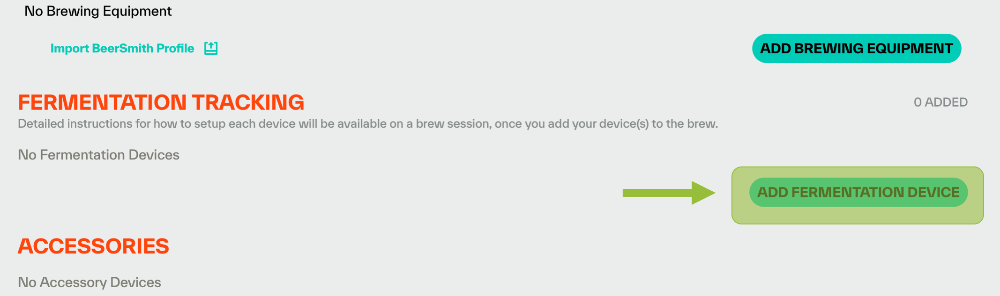
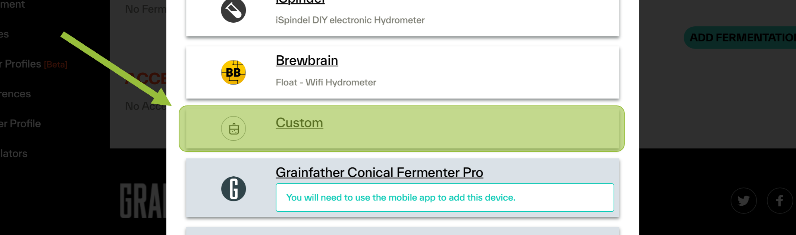
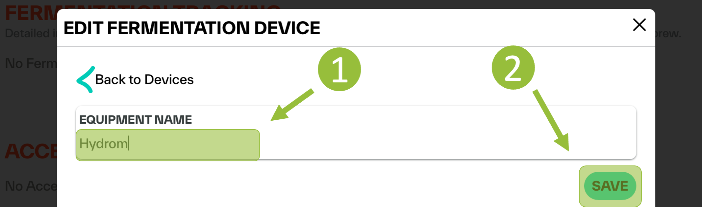
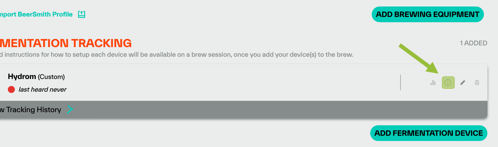
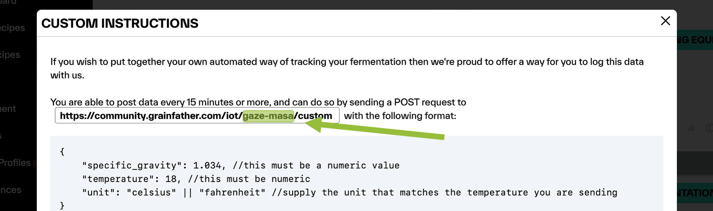

# Connect the Hydrom to Grainfather

!!! tip
    **Prerequisite:**

    1. **Access to user interface**\
       To make this setting, you must have access to the user interface. If this is not the case, see here how to do it:[access-to-the-user-interface.md](access-to-the-user-interface.md)
    2. **Grainfather user account available**.\
       An account has been created with the cloud provider Grainfather.
    3. **Grainfather App was downloaded**.\
       https://grainfather.com/brewing-app/

## Preparing the service

In order to make the Hydrom known to the Grainfather application, the Hydrom must be created in the application.

### Step 1: Navigate to the equipment manager.

Select the icon at the bottom that looks like a boiler, then the equipment manager will open up

<figure><figcaption></figcaption></figure>

### Step 2: Add Fermentation device

The Hydrom should be added as a "Fermentation device".

<figure><figcaption></figcaption></figure>

### Step 3: Select device type

Unfortunately, the Hydrom is not yet natively supported, so you still have to take the detour via the custom device. Please select the custom device.

<figure><figcaption></figcaption></figure>

### Step 5: Choose device name

Here you have to choose a device name (1).\
If there are several devices the name should be chosen speaking.\
Then confirm with "Save" (2).

<figure><figcaption></figcaption></figure>

### Step 6: Copy the ID

If the saving was successful, then the created device will appear in the Fermentation Tracking part.\
Clicking on the information menu opens the window where you can find the connection settings.

<figure><figcaption></figcaption></figure>

between "/iot/" and "/costum" there are two words, separated by a minus. these two words must be copied.

<figure><figcaption></figcaption></figure>

Now let's switch to the Interface of the Hydrom.

## Setting up the Hydrom

Now open the user interface of the Hydrom, in the best case the Hydrom is already in the network and can be reached easily via http://Hydrom001/.

Otherwise, the Hydrom still needs to be started.

## Step 1: Open the Menue

To access the menu bar you have to click on the three lines in the upper left corner. (See arrow)\
Then the menu bar will open.

## Step 2: Select "Service"

The "Services" page is a resource that allows users to select and configure various interfaces and cloud services for use with their system. On this page, users can choose from three different interfaces - HTTP, MQTT, and TCP - and several cloud services, and then activate and parameterize these options to suit their needs. This page is a useful tool for those who want to connect their system to the cloud or other external services and customize the way in which data is transmitted and received. With the options available on the "Services" page, users can tailor their system to meet their specific requirements and ensure that it is able to communicate effectively with other devices and systems.

## Step 3: Activate Grainfaher

1. then search for "Grainfather" in the list of services and activate it.
2. a selection of settings will appear.
3. You can keep the settings. You just need to replace the "XXXX-XXXX" part with the two words from the GF app. This way GF knows that the Hydrom is sending data.

<figure><figcaption></figcaption></figure>

Now you just have to check if the connection to Grainfather is successful by sending a test message (See chapter [send test message](connect\_to\_grainfather.md#send-test-message)) and if the connection was successful you have to put the Hydrom into [deep sleep](../configuration/enable-deepsleep.md) so that the readings are sent constantly in the set time.

### additional settings

In order not to consume too much power, we would turn Bluetooth off when it is not needed. It was documented here:

[Enable Bluetooth on the Hydrom](bluetooth/README.md)

In order for the Hydrom to transmit the data reliably, a DeepSleep time must be set. This is documented on this page:

[enable-deepsleep.md](../configuration/enable-deepsleep.md)

### Save Settings

Saving the data is important because it is the only way to connect to the service after waking up from DeepSleep.

You can check whether the saving was successful by looking at the settings file at http://Hydrom001/settings.json/. to check if the save was successful. This file is the permanent memory of the Hydrom.

A second way to check the saving is to reload the page (all modern browsers offer this Feature). If the properties are then reloaded, the Hydrom has accepted them, otherwise the old settings are reloaded.

### Send Test-message

By activating this button, you can check whether the Hydrom has a connection to the service and to the individual parts of the service. If you now click on "Save", the set services are executed once and the page is reloaded. On the new page you can see whether the servers are accessible and the ports are open.

### activate DeepSleep

Activating DeepSleep is mandatory for the Hydrom to be able to send data. If DeepSleep is activated, the Hydrom wakes up after the set time and sends the data to the set service. Afterwards, the Hydrom goes back to sleep and waits for the new service.

[enable-deepsleep.md](../configuration/enable-deepsleep.md)

!!! tip
    To ensure that the device sends measured values to the Service in the set interval as intended, the Hydrom must be put into deep sleep.

    There are two ways to put the Hydrom into deep sleep.

    Turning the _**power switch off and on**_ is the easiest way to put the Hydrom into deep sleep.

    The alternative way is to put it to sleep _**via the UI**_. To do this, open the navigation bar and go to the "DeepSleep" tab.
