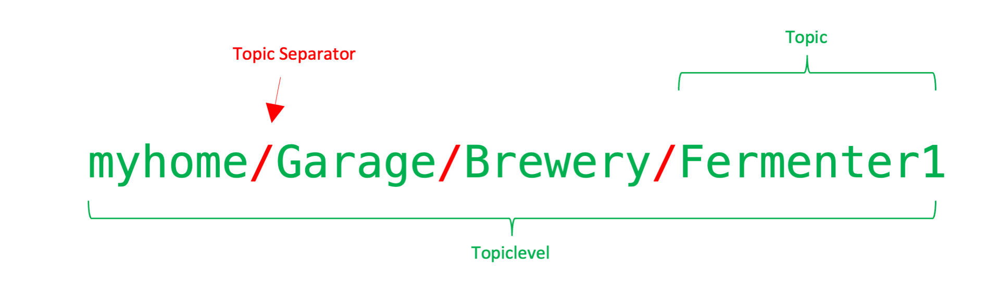

# To set up the Hydrom as an MQTT publisher

!!! tip
    **Prerequisite:**

    1. **Access to user interface**\
       To make this setting, you must have access to the user interface. If this is not the case, see here how to do it:[access-to-the-user-interface.md](access-to-the-user-interface.md)
    2. **Access to an MQTT server**.\
       An MQTT server has been set up or there is access to a cloud MQTT server.

## Collect the information from the MQTT interface

* Server (IP Adress)
* Port
* Username
* Password
* Topiclevel

## Insert MQTT settings in Hydrom

Now open the user interface of the Hydrom, in the best case the Hydrom is already in the network and can be easily accessed via Webpage.\
If there are questions about how to get to the user interface, the following page is recommended: [access-to-the-user-interface.md](access-to-the-user-interface.md)

Otherwise the Hydrom must still be started.

## Step 1: Open the Menue

To access the menu bar you have to click on the three lines in the upper left corner. (See arrow)\
Then the menu bar will open.

## Step 2: Select "Service"

The "Services" page is a resource that allows users to select and configure various interfaces and cloud services for use with their system. On this page, users can choose from three different interfaces - HTTP, MQTT, and TCP - and several cloud services, and then activate and parameterize these options to suit their needs. This page is a useful tool for those who want to connect their system to the cloud or other external services and customize the way in which data is transmitted and received. With the options available on the "Services" page, users can tailor their system to meet their specific requirements and ensure that it is able to communicate effectively with other devices and systems.

### Activate MQTT and change the settings

On the "Service" page, the MQTT service must be activated.

\*\*Server Address: Name or IP of the MQTT broker.

**Server Port:** MQTT port, which is 1883 by default.

**Username:** You get the username from the MQTT broker.

**Password:** You get the password from the MQTT broker.

### Topiclevel and explanation

In MQTT, the word Topic refers to a UTF-8 string that the broker uses to filter messages for each connected client. The topic consists of one or more topic levels also called topiclevel. Each topic level is separated by a slash.

<figure><figcaption>
Explanation Topiclevel
</figcaption></figure>

### Example values

The following parameters are transmitted via MQTT:

* myhome/garage/brewery/fermenter/hydrom/ tilt\_G 61.51\
  This value is the real angle of the hydrom in space.\
  If the hydrom is horizontal, this value will be 0 degrees.\
  If the hydrom is vertical in the water, this value will be 90 degrees.
* myhome/Garage/Brewery/Fermenterl/Hydrom/tilt\_SG 1.038\
  This value is the calculated Specific Gravity value measured by the Hydrom and calculated using the calculation formula after calibration.
*   myhome/Garage/Brewery/Fermenterl/Hydrom/tilt\_P 9.684916496

    This value is the calculated Plato value measured by the Hydrom and calculated with the calculation formula after calibration.
*   myhome/Garage/Brewery/Fermenterl/Hydrom/temperature 20.5

    This is the measured temperature in degrees Celsius.
*   myhome/Garage/Brewery/Fermenterl/Hydrom/temp\_units C

    This is the unit in which the temperature is transmitted
*   myhome/garage/brewery/fermenter/hydrom/battery 4.20

    This is the measured battery voltage.\
    100%=4,20V\
    0%=3V
*   myhome/Garage/Brewery/Fermenterl/Hydrom/gravity 9.68

    This value is the calculated Plato value measured by the Hydrom and calculated with the calculation formula after calibration.
*   myhome/Garage/Brewery/Fermenterl/Hydrom/interval 900

    This is the transmission period. Here a measured value is transmitted every 900s
*   myhome/Garage/Brewery/Fermenterl/Hydrom/RSSI-60

    The transmission power of the WLAN.

### additional settings

In order not to consume too much power, we would turn Bluetooth off when it is not needed. It was documented here:

[Enable Bluetooth on the Hydrom](bluetooth/README.md)

In order for the Hydrom to transmit the data reliably, a DeepSleep time must be set. This is documented on this page:

[enable-deepsleep.md](../configuration/enable-deepsleep.md)

### Save Settings

Saving the data is important because it is the only way to connect to the service after waking up from DeepSleep.

You can check whether the saving was successful by looking at the settings file at http://hydrom001/settings.json/. to check if the save was successful. This file is the permanent memory of the Hydrom.

A second way to check the saving is to reload the page (all modern browsers offer this Feature). If the properties are then reloaded, the hydrom has accepted them, otherwise the old settings are reloaded.

### Send Test-message

By activating this button, you can check whether the Hydrom has a connection to the service and to the individual parts of the service. If you now click on "Save", the set services are executed once and the page is reloaded. On the new page you can see whether the servers are accessible and the ports are open.

### activate DeepSleep

Activating DeepSleep is mandatory for the hydrom to be able to send data. If DeepSleep is activated, the hydrom wakes up after the set time and sends the data to the set service. Afterwards, the hydrom goes back to sleep and waits for the new service.

[enable-deepsleep.md](../configuration/enable-deepsleep.md)

!!! tip
    To ensure that the device sends measured values to the Service in the set interval as intended, the Hydrom must be put into deep sleep.

    There are two ways to put the Hydrom into deep sleep.

    Turning the _**power switch off and on**_ is the easiest way to put the Hydrom into deep sleep.

    The alternative way is to put it to sleep _**via the UI**_. To do this, open the navigation bar and go to the "DeepSleep" tab.

## View Hydrom readings on the MQTT broker

### Check if the topic has been published

Here it is recommended to use a MQTT client app. Under IOS I recommend the app MQTTAnalyzer.

With this app you can connect to the broker and subscribe to the topiclevel and get the measured values. This way you can make sure in the first step that the data is sent correctly and received correctly by the broker.

### The further procedure is strongly dependent on the MQTT client.

It is not possible to describe a general procedure here. In the future, sample configurations for the most common clients will appear here, for which I ask for your help. Please send me your working configurations and I will publish them here, anonymized of course.
