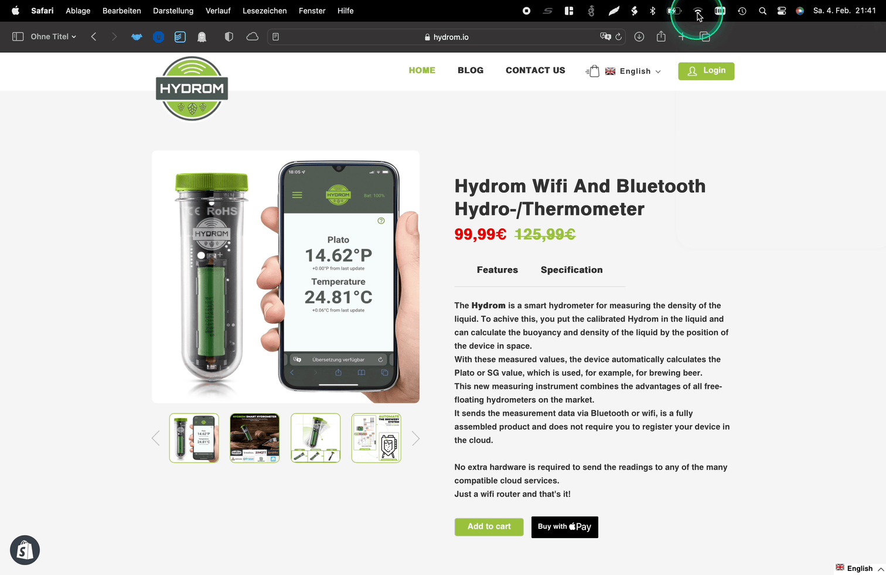

# Connect to existing WiFi

<figure><figcaption></figcaption></figure>

!!! info
    Requirement that the Hydrom has for the WiFi:

    * 802.11 b/g/n
    * 802.11 n (2.4 GHz), up to 150 Mbps
    * WiFi name length: max 30 characters
    * WiFi password length: max 63 characters
    * Supported special characters for name and password:
    * a-zA-Z0-9!/#$&'()\*+a-zA-Z0-9!/#$
    * Security: WEP/WPA-TKIP/WPA2-CCMP

To change the network settings, open the navigation bar on the left side and select the "Wifi" option

## Connect Hydrom to a WiFi that already exists

To set up the Hydrom as a client in an existing network, enter the name of the existing network in the field under "SSID". This setting allows the device to connect to an existing WiFi.

There are services that rely on the Hydrom having access to the Internet. If the Hydrom connects to a WiFi that does not have Internet, only local services will be available.

After you have entered the desired settings, press "Save".

Here is an example of the settings for an existing WiFi:

### Save Settings

You can check whether the saving was successful by looking at the settings file at http://hydrom001/settings.json/. to check if the save was successful. This file is the permanent memory of the Hydrom.

A second way to check the saving is to reload the page (all modern browsers offer this Feature). If the properties are then reloaded, the hydrom has accepted them, otherwise the old settings are reloaded.
